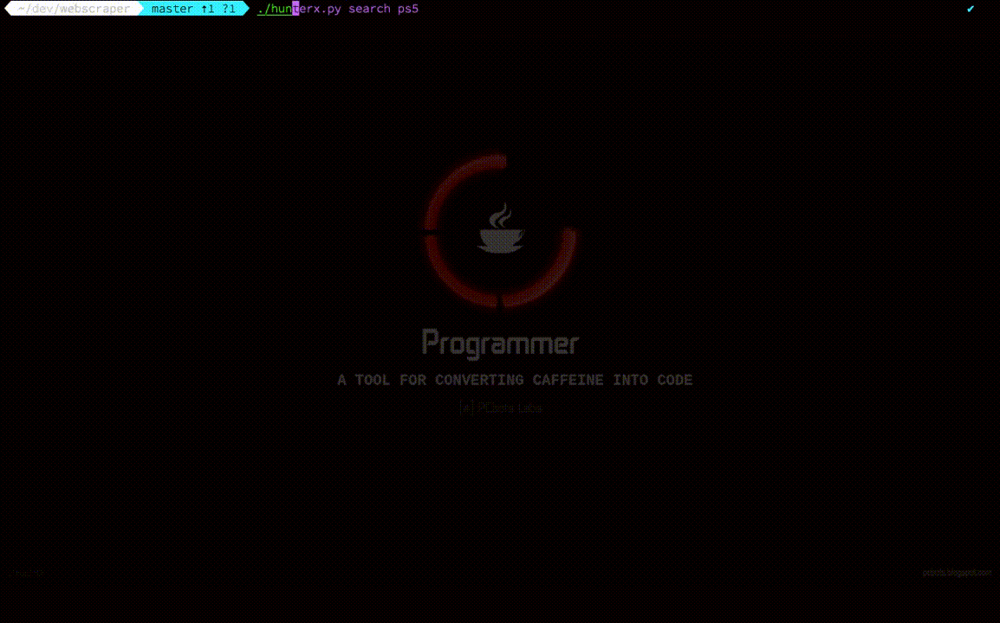

# HunterX


## Table Contents

* [Technologies](#technologies)
* [Search](#search)
* [Save](#save)
* [View](#view)
* [Clear](#clear)

## Technologies

* Python 3.8.3
* PostgreSQL
* Docopt


## Search 

Running the ``search`` command returns various prices pertaining to the specified product. An option menu is generated that displays search results for the product, once an option has been selected a table is returned listing sellers, prices and availability.

```
$ ./hunterx.py search product
``` 



## Save 

To save the cheapest deal in stock, the optional flag ``-s``  or  ``--save`` can be used with the ``search`` command. If you have an existing account the deal will be added to your account, otherwise a new account is created.

```
$ ./hunterx.py search product -s
``` 


## View 


To view all of the saved deals for an account, the ``view`` command can be used followed by the username. For validation a password is required.

```
$ ./hunterx.py view username
``` 


## Clear 

To clear all the deals in your account the ``-d`` or ``--delete`` flag can be used.

```
$ ./hunterx.py view username -d
``` 


## Delete 

The ``-d`` flag can also be used with the ``account`` command to permanently delete the account

```
$ ./hunterx.py account username -d
``` 


